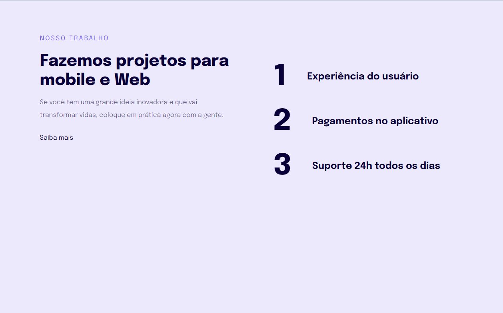

# Stage 02

# Projeto-04-Introdução a responsibidade

> Trilha Explorer 

Projeto construido no stage 03 do programa Explorer da rocketseat - Avaçando no HTML e CSS

👉🏼[Clique aqui para accessar](https://projeto04-intro-responsibidade.netlify.app/)

👉🏼[Clique aqui para accessar](https://jose26362780.github.io/Projeto-04-Introdu-o-a-responsibidade-/)

##  🔧 Tecnologias

- Html 
- Css
- Git e Github

##  🖥️ O que aprendi 

- pontos de quebra
- medidas relativas
- mobile first
- media queries
- testes de pontos de quebra em dimensões responsivas
- regra das unidades de medida flexiveis

## Contato 💻🧑‍💻 

juniorjose1925@gmail.com

https://www.linkedin.com/in/jose-martinez-352032222/
